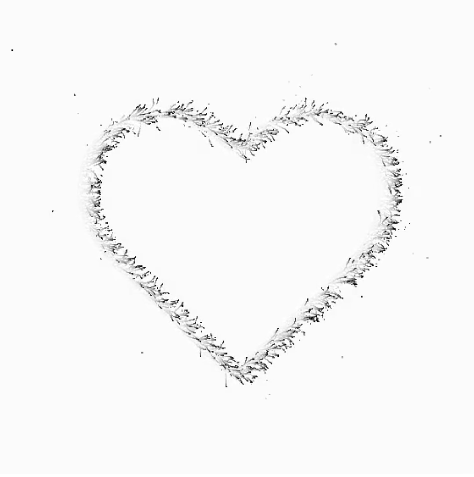
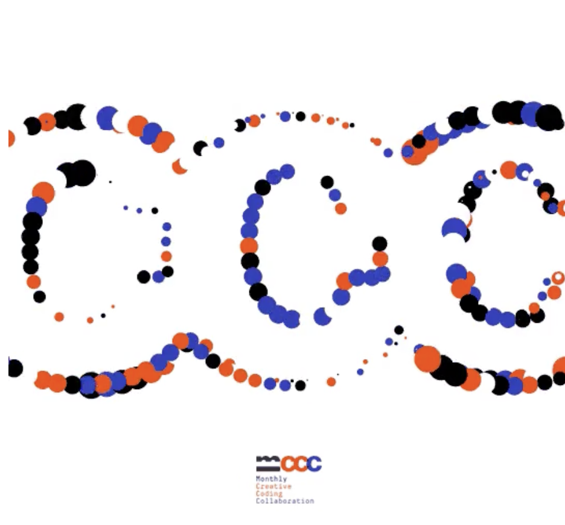
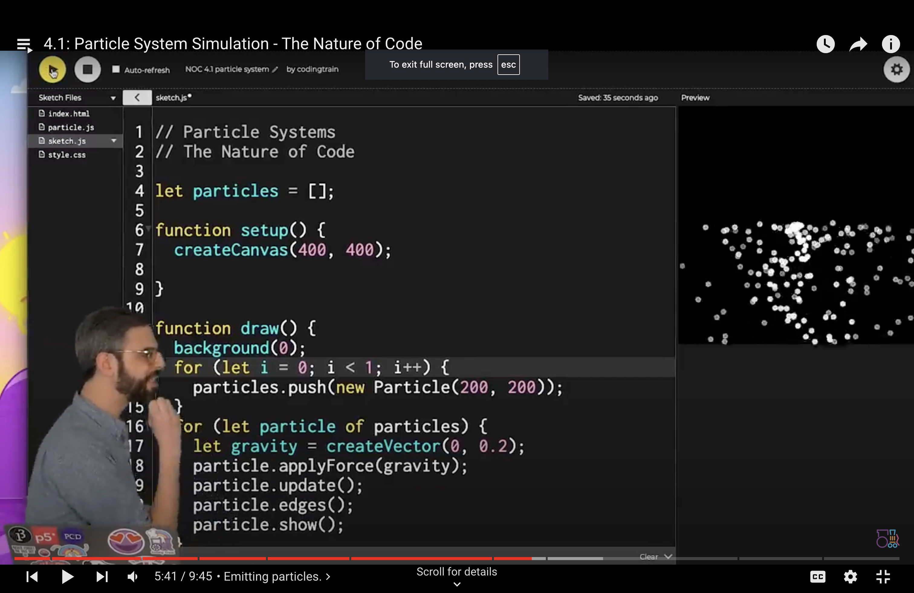
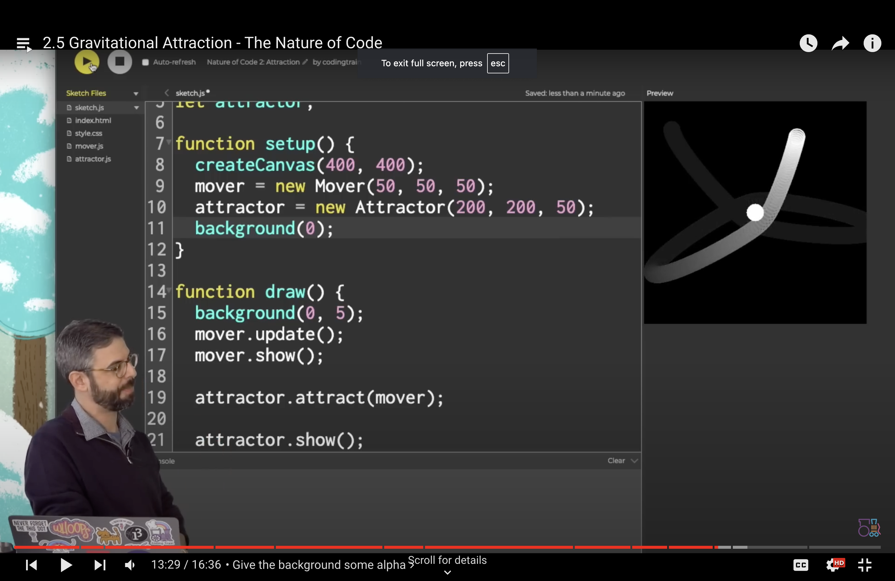

mfal0927_9103_tut4

# Week 8 Quiz

## Imaging Technique Inspiration
The art chosen for this assignment is **Pablo Picasso's Dove of Peace**. 

Inspired by the innovative techniques of artist [Patrik Huebner](https://www.patrik-huebner.com/creative-coding/), I plan to transform the original art, which mainly consists of lines, into a dynamic composition of multiple dots that will come to life through animation.

[Click to see video](https://media.patrik-huebner.com/ideas/sketch_32_01.mp4)

I plan to transform the original art, which consists of lines, into a composition of multiple dots that will come to life through animation.
I plan to take the original lines of the art and transform them into an array of dots, as seen in the video above. These dots will then be animated, and with a trigger, they will transform into text. 

[Click to see video](https://media.patrik-huebner.com/ideas/sketch_27_02.mp4)

The transformation journey will culminate in the formation of the word "B I R D."

## Coding Technique Exploration
- I plan to use a nested loop to get the X & Y position of the dove pixels and store them in an array
- Then, using the particle system simulation technique, I plan to make a burst of particles that originate from the x & y position that makes up the dove art (The Coding Train, 2021). 

- Using the initial position as an attractor, I plan to animate the particles that revolve around the attractor (The Coding Train, 2021).

- Then, when a keyboard is pressed, the particle will move into a new position that makes up the word “B I R D”.

---

**References**
- 2021, The Coding Train, https://www.youtube.com/watch?v=syR0klfncCk&list=PLRqwX-V7Uu6ZV4yEcW3uDwOgGXKUUsPOM&index=32&ab_channel=TheCodingTrain, last accessed: Sept 25th 2024
- 2020, The Coding Train, https://www.youtube.com/watch?v=EpgB3cNhKPM&list=PLRqwX-V7Uu6ZV4yEcW3uDwOgGXKUUsPOM&index=21&ab_channel=TheCodingTrain, last accessed: Sept 25th 2024
- 2015, Patrick Huebner, https://www.patrik-huebner.com/creative-coding/recursive-animations/, last accessed: Sept 25th 2024
- 2015, Patrick Huebner, https://www.patrik-huebner.com/creative-coding/mccc-november/, last accessed: Sept 25th 2024

>**Acknowledgement**
Grammarly was used to assist with grammar check on this assignment
